<picture>
  <source media="(prefers-color-scheme: dark)" srcset="assets/catfetch-dark.svg" />
  
</picture>

[aahil-khan.xyz](https://aahil-khan.xyz) · [resume](https://www.aahil-khan.xyz/aahil-khan-resume.pdf) · [linkedin](https://www.linkedin.com/in/aahil-khan77/) · [email](mailto:aahilminookhan@gmail.com)

 

I build whatever sends me down a rabbit hole. These days it's mostly software, with a little electronics on the side.

The cat above is redrawn twice a day from my GitHub activity. It stays awake while I'm committing and falls asleep when I stop.

### `ls ~/projects`

| | |
|---|---|
| [**SOP Opera**](https://github.com/aahil-khan/SOP-Opera) [live](https://sop-opera.vercel.app) | Turns industrial sensor signals into operational intelligence, with explanations an operator can check. 🏆 1st place, Economic Times AI Hackathon 2.0 |
| [**Konta**](https://github.com/konta-oss/konta) | A Chrome extension that turns your browsing sessions into a searchable knowledge graph. 🏆 Winner, Samsung PRISM Web Agent Hackathon 2025 |
| [**FlowSync**](https://github.com/anoushkawasthi/flowsync) | Persistent project memory for coding agents, served over MCP and built on Amazon Bedrock. 🏅 Innovation Award, Agentic AI Hackathon, Ulster University (UK) 2025 |
| [**holt**](https://github.com/holt-oss/holt) | Finds open-source projects that will actually merge your first PR, using evidence from their real pull-request history. |
| [**krow**](https://github.com/aahil-khan/krow) | Scans public-facing assets for quantum-vulnerable crypto and writes a CycloneDX CBOM with a PQC risk score. |
| [**Kriptic**](https://github.com/aahil-khan/Kriptic) | An off-grid safety kit for internet shutdowns: encrypted mesh messaging, offline maps and a silent SOS. |
| [**Peekaboo**](https://github.com/aahil-khan/Peekaboo) | A desktop AI overlay. Press a shortcut, ask a question, get back to work. |

<code>cat ~/.skyline</code>: a year of commits, stacked into a city

 

 

<picture>
  <source media="(prefers-color-scheme: dark)" srcset="assets/walk-dark.svg" />
  
</picture>
