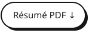
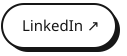

<picture><source media="(prefers-color-scheme: dark)" srcset="assets/hero-dark.svg" /></picture>

<a href="https://aahil-khan.xyz"><picture><source media="(prefers-color-scheme: dark)" srcset="assets/btn-site-dark.svg" /></picture></a>
<a href="https://www.aahil-khan.xyz/aahil-khan-resume.pdf"><picture><source media="(prefers-color-scheme: dark)" srcset="assets/btn-resume-dark.svg" /></picture></a>
<a href="https://www.linkedin.com/in/aahil-khan77/"><picture><source media="(prefers-color-scheme: dark)" srcset="assets/btn-linkedin-dark.svg" /></picture></a>
<a href="mailto:aahilminookhan@gmail.com"><picture><source media="(prefers-color-scheme: dark)" srcset="assets/btn-email-dark.svg" /></picture></a>

I build whatever sends me down a rabbit hole. These days it's mostly software, with a little electronics on the side.

 

<picture><source media="(prefers-color-scheme: dark)" srcset="assets/work-head-dark.svg" /></picture>
<a href="https://github.com/holt-oss/holt"><picture><source media="(prefers-color-scheme: dark)" srcset="assets/work-holt-dark.svg" /></picture></a>
<a href="https://github.com/aahil-khan/SOP-Opera"><picture><source media="(prefers-color-scheme: dark)" srcset="assets/work-sop-opera-dark.svg" /></picture></a>
<a href="https://github.com/konta-oss/konta"><picture><source media="(prefers-color-scheme: dark)" srcset="assets/work-konta-dark.svg" /></picture></a>
<a href="https://github.com/anoushkawasthi/flowsync"><picture><source media="(prefers-color-scheme: dark)" srcset="assets/work-flowsync-dark.svg" /></picture></a>

Write-ups on [aahil-khan.xyz](https://aahil-khan.xyz/#work). Also around here: [GINA](https://github.com/vanshGupta18/Gina_cfp) · [Peekaboo](https://github.com/aahil-khan/Peekaboo)

 

<picture><source media="(prefers-color-scheme: dark)" srcset="assets/stack-dark.svg" /></picture>

  

<a href="mailto:aahilminookhan@gmail.com"><picture><source media="(prefers-color-scheme: dark)" srcset="assets/footer-dark.svg" /></picture></a>
